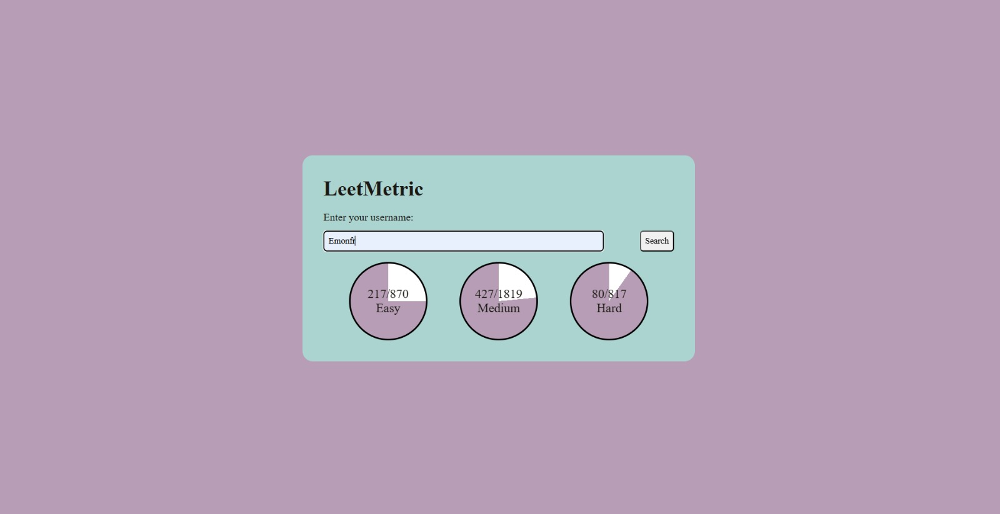

# LeetMetric

LeetMetric is a web application that allows users to track their LeetCode problem-solving progress by entering their LeetCode username. The application fetches user statistics from a public API and visually represents their progress in different problem categories.

## 🛠 Features
- Fetch LeetCode problem-solving statistics using a username.
- Display progress in Easy, Medium, and Hard problem categories.
- Visual representation of problem-solving progress using circular progress indicators.
- Responsive and user-friendly design.

## 🚀 Tech Stack
```md
- **Frontend:** HTML, CSS, JavaScript
- **API:** [LeetCode Stats API](https://leetcode-stats-api.herokuapp.com/)
```

## 📂 Project Structure
```md
LeetMetric/
│── index.html       # Main HTML file
│── style.css        # Stylesheet
│── index.js         # JavaScript logic for fetching and displaying user data
│── README.md        # Project documentation
│── leetmetric_UI.jpeg  # Screenshot of the UI
```

## 📌 Installation & Usage
```sh
# Clone the repository
git clone https://github.com/yourusername/LeetMetric.git

# Navigate to the project directory
cd LeetMetric

# Open index.html in your browser to run the application
```

## 🎯 How It Works
```md
1. Enter your LeetCode username in the input field.
2. Click on the **Search** button.
3. The application fetches user statistics and displays:
   - Total problems solved
   - Breakdown of Easy, Medium, and Hard problems
   - Circular progress indicators for each difficulty level
```

## 📸 Screenshots
### User Interface


## 🔗 API Reference
```md
- The application fetches data from [LeetCode Stats API](https://leetcode-stats-api.herokuapp.com/).
```

## 🛠 Future Enhancements
```md
- Improve UI/UX with better animations and responsiveness.
- Add more statistics such as ranking and contest participation.
- Cache user data to reduce API calls.
```

